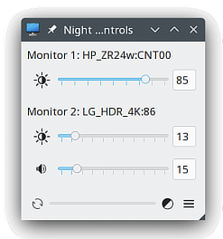

vdu_controls - a GUI wrapper for ddutil
=======================================

A GUI for controlling connected *Visual Display Units* (*VDU*'s) (also known as *displays*, or *monitors*).

Description
-----------

``vdu_controls`` is a virtual control panel for physically connected VDU's.  It displays a set of controls for
each  DVI/DP/HDMI/USB connected VDU and uses the ``ddcutil`` command line utility to issue *Display Data Channel*
(*DDC*) *Virtual Control Panel*  (*VCP*) commands to each of them.

By default ``vdu_controls`` offers a subset of the possible controls including brightness, and contrast.  Additional 
controls can be enabled via the ``--enable-vcp-code`` option.

   

Getting Started
---------------

To get started with ``vdu_controls``, you only need to download the ``vdu_controls.py`` python script and
check that the dependencies described below are in place.

Dependencies
------------

All the following runtime dependencies are likely to be available pre-packaged on any modern Linux distribution 
(``vdu_controls`` was originally developed on OpenSUSE Tumbleweed).

* ddcutil: the command line utility that interfaces to VDU's via DDC over i2c-dev or USB.
* i2c-dev: the i2c-dev kernel module normally shipped with all Linux distributions and required by [ddutil](https://www.ddcutil.com)
* python 3.8: ``vdu_controls`` is written in python and may depend on some features present only in 3.8 onward.
* python 3.8 QtPy: the python GUI library used by ``vdu_controls``.

Installing
----------

As previously stated, the ``vdu_vontrols.py`` script is only file required beyond the prerequisites. There are
two options for "installation": 

* The script can be run without installation by using a python interpreter, for example:\
  ``% python3 vdu_controls.py`` 
* The script can be self installed as desktop application in the desktop menu as *Settings->VDU Controls* by running:\
  ``% python3 vdu_controls.py --install``\
  depending on which desktop you're running menu changes may require logout before they become visible.

Executing the program
---------------------

* If installed by running the ``--install`` option, a menu item named **VDU Controls** should be able to be located in 
the settings menu or by entering part of its name in the application menus search bar.
* If ``--install`` option has been run, a script called ``vdu_controls`` should be in $HOME/bin.
  If ``$HOME/bin`` is on the user's ``PATH``, ``vdu_controls`` will be able to be run from the command
  line, for example:\
  ``% vdu_controls --show brightness --show contrast --show audio-volume``
* If the script has not been installed, it can still be run on the command line via the python interpreter, 
  for example:\
  ``% python3 vdu_controls.py  --show brightness --show contrast``

Help
----

Brief help can always be accessed via the command line help option
```
% python3 vdu_controls.py --help
# or if installed in $HOME/bin
% vdu_controls --help
```

Whether run from the desktop application-menu or run from the command line, ``vdu-controls`` behaviour can be altered
by a number of command line options, see the [man page](https://htmlpreview.github.io/digitaltrails/vdu_controls/docs/_build/man/vdu_controls.1.html) for details.

Development
-----------

I've set up the ``vdu_controls`` source with a typical Python development, but there is only one real source
file, ``vdu_controls.py``, so the file hierarchy is rather over the top.  A standard python distributable 
can be built by issuing the following commands at the top of the project hierarchy:
```
% python3 -m build
...
% ls -1 dist/
total 268
vdu_controls_digitaltrails-1.0.0-py3-none-any.whl
vdu_controls-digitaltrails-1.0.0.tar.gz
```

Configuration files for the [Sphinx Python Documentation Generator](https://www.sphinx-doc.org/en/master/index.html) 
markup configuration has been proved to extract a manpage or HTML help from ``vdu_controls.py``. If Sphinx is
available, the following commands will extract documentation from ``vdu_controls.py``:
```
% cd docs
% make man
% make html
```

My IDE for this project is [PyCharm Community Edition](https://www.jetbrains.com/pycharm/)

Authors
-------

Michael Hamilton\
``m i c h a e l   @  a c t r i x   .   g e n  . n z``


Version History
---------------

* 1.0
    * Initial Release

License
-------

This project is licensed under the **GNU General Public License Version 3** - see the [LICENSE.md](LICENSE.md) file 
for details

**vdu_controls Copyright (C) 2021 Michael Hamilton**

This program is free software: you can redistribute it and/or modify it
under the terms of the GNU General Public License as published by the
Free Software Foundation, version 3.

This program is distributed in the hope that it will be useful, but
WITHOUT ANY WARRANTY; without even the implied warranty of MERCHANTABILITY
or FITNESS FOR A PARTICULAR PURPOSE. See the GNU General Public License for
more details.

You should have received a copy of the GNU General Public License along
with this program. If not, see <https://www.gnu.org/licenses/>.

## Acknowledgments

* [ddutil](https://www.ddcutil.com)
* [pyqt](https://riverbankcomputing.com/software/pyqt/)
* [Sphinx Python Documentation Generator](https://www.sphinx-doc.org/en/master/index.html)
* [PyCharm Community Edition](https://www.jetbrains.com/pycharm/)
* [Pandoc](https://pandoc.org/)